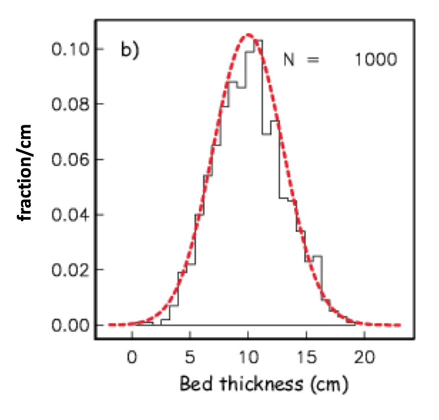

### Introductions ###
	Sean - BioOce lab - Flow cytometry lab
	Bri - Vert Lab - Marine Mammal acustics
	Alan - Geooce Lab - Core samples
	Holly - BioOce - Counting cells, flow cytometry
	Tim - HMS - Remote sensing, CTD timeseries
	Steve - Phycology -  ADP (Acoustic Doppler Profile) data, plotting

### Course Information

#### Websites 
<b>Moodle</b>
- Readings
- Lectures
- Discussion forum

<b>Github</b> 
[github.com/mlmldata2017](github.com/mlmldata2017)
- Homework assignments and starter code
- Tutorials
- Course Notes

#### Assignments

Homework will be weekly

###### Final Project
format: Jupyter notebook
* Code, text, images
* Open ended, but using data that is interesting or related to your thesis project.

#### Office Hours

Tom's Office Hours: Mondays 1-4pm, Wednesdays 1-4pm  
Patrick's Office hours: Tuesday 4-5pm, Thursdays 1-4pm

### Types of Data ###
__Discrete__ - represented by an integer (whole number)- counts, presence/absence  
__Continuous__ - represented by real1 numbers (e.g. temperature) (floating point)  
__Categorical__ - hair color, locations (sites) 
__Metadata__ - "data describing data"

1 *Actually, vectors can be represented as complex numbers with an imaginary part*

### Types of Measurements ###
__Nominal__ - categories of equal rank 
__Ordinal__ - Categories have a logically defined rank 
__Scale__: __interval__ and __ratio__
- Size Categories, Steps not necessarily equal or quantifiable 
	examples:
	How sediment grains are categorized, x-axis: angularity vs y-axis: sphericity
	Hurricane scale: ranking is not equivalent to strength 
	Beufort Wind Scale: Mariner estimate of wind from wave climate, logically defined, but not quantifiable

	__interval scale__: temperature scale  
	__ratio scale__: natural zero point
	ex: length, mass

### Types of Error ###
__Systematic error__  - systematically repeatable biased  
__Random error__ - Impercise, but unbiased

__Measurement precision__ 
You would record a value from a ruler to 3.7567453 cm if your ruler only has mm hash marks

Rounding introduces error into your calculations, so in general it is better to use all of the digits that you have and round off to the significant digit when reporting the value

__Drift__ - a systematical error that changes over time

Johnson and Coletti (2002)

Bottle data (squares): chemically derived values of nitrate (low resolution, high precision) 
ISUS Nitrate Sensor (High resolution, systematic error (underreported values compared to bottle casts) , instrument noise (small scale random error))

Smoothing of to remove noise (lowers resolution) 
Temperature Bias correction

__Normal Distribution__

[source](https://earthref.org/MagIC/books/Tauxe/Essentials/WebBook3ch11.html) 
Bars: Fraction of samples that occur in each range, per bed thickness, normalized

Black Line:Probability density = fraction/Δx (Real line) 
Redline: Normal distribution (hypothetical), allows the use of mathematical theories to use statistics  

Integral of area under the curve = 1 (all probability falls under the curve)

[Wikipedia](https://en.wikipedia.org/wiki/Normal_distribution#/media/File:Empirical_Rule.PNG)

### Mean ###

### Variance ###

__Algorithm__: A problem solving procedure - set of instructions to solve a problem

Finding the __Mean__ in plain English:
	1. Take Samples
	2. Add up all of the values in the set
	3. Count the total number of values in the set
	4. Divide the step 2. / step 3.

Finding __Variance__ in plain English:
	1. Take samples
	2. Find Mean (as stated above)
	3. Subtract mean from each sample
	4. Square step 3
	5. Sum step 4
	6. Count the number of samples
	7. Subtract 1 from step 6
	8. Divide step 5 by strep 7.

### Computers ###
[__Raspberry Pi__](https://hackaday.io/projects/tag/raspberry%20pi) A small, cheap computer that usually runs linux distributions
__CPU__:Central Processing Unit - Processes user instructions from an input
__RAM__:Random Access Memory - Stores data for the short term, where is can be quickly accessed. Limited capacity
Long-term Memory: Usually a hardrive, large capacity, data access is slower.

Computers are made of tons of tiny switches called __transistors__ that can be turned On or Off (1 or 0).
The number of transistors that can be placed on a CPU has grown exponentially over the past 40 years.

**Moore's Law**: Pn = Po2n

With more processing power:
- Can run models, collect more data at higher resolutions
- Computation is cheap! A more people have access to computers
- Programming languages are built to be more accessible, but less efficient

**Interpreted Languages** - Python, code is translated into machine language line by line

**Compiled Languages** -Java, C, Fortran, entire code is compiled into object code, then into machine language. Can be much faster if you are resusing the code or making programs, but less practical for data analysis.

**Bit**: binary digit (1 or 0)

**Byte**: eight bits

##### Representing integers in binary

Numbers are stored on computers in binary representation. Positive integers can be represented as a combination of powers of two. For example:

0 0 1 0 1 0 1 0

=(0·27)+(0·26)+(1·25)+(0·24)+(1·23)+(0·22)+(1·21)+ (0·20)

= 42

= (0·102) + (4·101) + (0·20)

This is an example of an **unsigned byte**. A byte can have 28 = 256 possible combinations. An unsigned byte can have any value between 0-255. Trying to calculate a number greater than 255 would result in an "overflow" error.

A **signed byte** uses the first bit to store the sign of the number.

Integers:
- unsigned byte (0-255) (8-bits)
- signed byte (-128 - 127)(8-bits)
- Short integer (-64,768 - 64,767)  (16-bits)
- Long Integer (32-bits) =   4,294,967,296 values

##### Representing decimals with floating point numbers

The binary numbers described above cannot represent numbers with decimals. Real numbers with many digits, and irrational numbers like pi, must be approximated. A number *x* is represented in the following form:

*x* = (+/-1)x(*m*)x10*E*

where *m* is called the mantissa.

IEEE 32 bit standard: single precision
* 1 bit - sign
* 8 bits - exponent
* 23 bits - mantissa

IEEE 64 bit standard: double precision
* 1 bit - sign
* 11 bits - exponent
* 52 bits - mantissa

###### Round-off error

Occurs when trying to represent real numbers with floating point numbers with a limited number of precision Can accumulate very quickly when repeating calculations.

###### Truncation error

Occurs when using finite number of steps to approximate an infinite number of steps, such as a Taylor series approximation.

__Exploring Python__
repl.it/languages/python3

print('Hello World!')
Hello World!

Syntax - These are the rules of the language, think of it as grammar.
If you get a, SyntaxError, it means Python cant handle something you've done because of an error in the syntax
