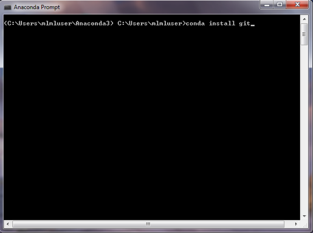
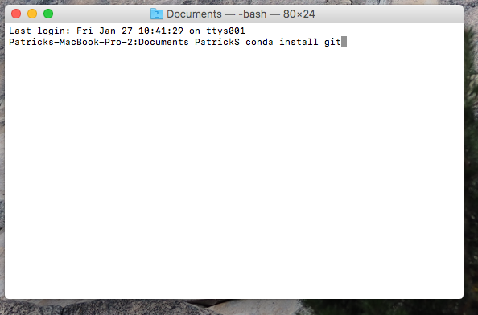
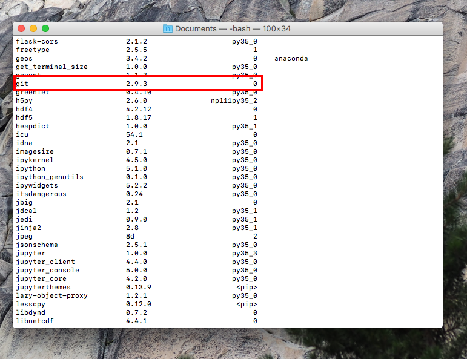

## Installing Anaconda, Git and a text editor

[For Windows instructions](#installing-on-windows)

[For OSX (Mac) instructions](#installing-on-osx)

### Installing on Windows

#### What is Anaconda/conda?

##### Anaconda
 
Anaconda is a distribution of python and a set of programs built specifically for data science. This includes:
* *python*: programming language (we'll be using version 3.6)
* *conda*: package manager
* [jupyter-notebook](http://jupyter.org/) web application that integrates live code, text, figures and equations
* [spyder](https://github.com/spyder-ide/spyder) integrated development environment

##### Conda

Conda is a package manager made by Continuum Analytics
 
* Package manager: Maintains the directories (folder pathways) and versions of external (non-default) python packages. A package is just a collection of code that can make your life a lot easier. Some of these are included with python, but others have to be downloaded from an external source.

#### Install Anaconda

Check to see if your operating system is 32-bit or 64-bit (Chances are with a newer computer, it is 64-bit)

Go to: https://www.continuum.io/downloads  
Select <b>Python 3.6 version</b> (we will be using Python 3 for this course)

#### Install Git
After installing Anaconda, open the program <b>"Command Prompt"</b>
You might have to search for this in the start menu. 

Then, run the command "<b>Conda install git</b>" in the terminal

This will install <b>git</b>, an important version control software  There may be a dialog asking you to installing or updating additional package. Enter "Y" and press enter. 
Now we want to verify that <b>git</b> is installed using the following command in the command prompt:  
<b>"conda list"</b>

This will display all of the packages and programs installed in this environment. Scroll down till you see <b>git</b>. This will tell you the version of the software or package. 

For the windows users, we will use a program that comes with git called <b>Git-Bash</b>. This is a Bash Shell, similar to the terminal on Unix (OSX and Linux) machines and using this will help us maintain continuity between both types of operating systems.

#### Sign up for a GitHub account

[Github](www.github.com) is a popular remote repository hosting service. This is a way to store and share version controlled software off of your computer. You can think of this sort of like dropbox for code and something we will use extensively in this class, but more on that later.

#### Install the Atom text editor
Text editors do exactly what their name implies (and often a lot more). In this class we will use Atom because it is available on all operating systems, has easy to use git support (it's created by the GitHub folks), and some cool custom plugins.
 
Download Atom at [atom.io](https://atom.io/)

### Installing on OSX

#### What is Anaconda/conda?

##### Anaconda
 
Anaconda is a distribution of python and a set of programs built specifically for data science. This includes:
* *python*: programming language (we'll be using version 3.6)
* *conda*: package manager
* [jupyter-notebook](http://jupyter.org/) web application that integrates live code, text, figures and equations
* [spyder](https://github.com/spyder-ide/spyder) integrated development environment

##### Conda

Conda is a package manager made by Continuum Analytics
 
* Package manager: Maintains the directories (folder pathways) and versions of external (non-default) python packages. A package is just a collection of code that can make your life a lot easier. Some of these are included with python, but others have to be downloaded from an external source.

#### Installing Anaconda

Check to see if your operating system is 32-but or 64-bit (Chances are with a newer computer, it is 64-bit)

Go to: https://www.continuum.io/downloads  
Select <b>Python 3.6 version</b> (we will be using Python 3 for this course)

#### Installing Git
After installing Anaconda, open the program <b>"terminal"</b>
This is located in Applications -> Utilities 
Or you can search for "terminal" in the spotlight (use press cmd-space).

 

Then, run the command "<b>Conda install git</b>" in the terminal

This will install <b>git</b>, an important version control software  There may be a dialog asking you to installing or updating additional package. Enter "Y" and press enter. 
Now we want to verify that <b>git</b> is installed using the following command in terminal:  
<b>"conda list"</b>
  
This will display all of the packages and programs installed in this environment. Scroll down till you see <b>git</b>. This will tell you the version of the software or package.  

#### Sign up for a GitHub account

[Github](www.github.com) is a popular remote repository hosting service. This is a way to store and share version controlled software off of your computer. You can think of this sort of like dropbox for code and something we will use extensively in this class, but more on that later.

#### Install the Atom text editor
Text editors do exactly what their name implies (and often a lot more). In this class we will use Atom because it is available on all operating systems, has easy to use git support (it's created by the GitHub folks), and some cool custom plugins.
 
Download Atom at [atom.io](https://atom.io/)
