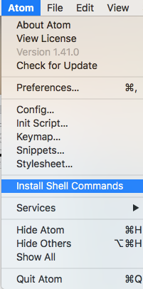
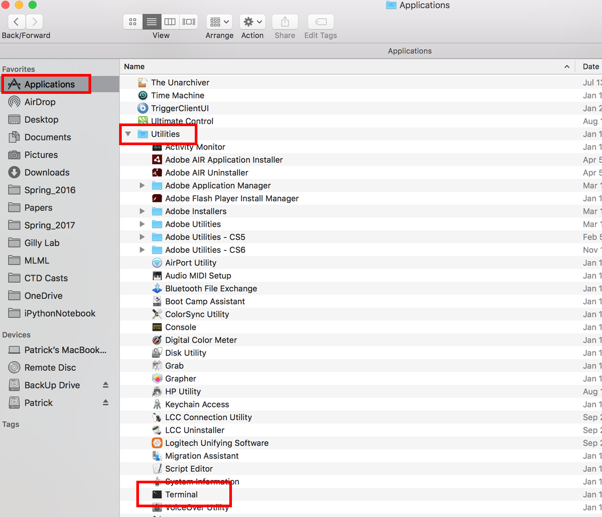

## Setup and software installation

### Storage requirements

You will need at least 2 GB free on your computer's hard drive.

### Sign up for a GitHub account

[Github](www.github.com) is a popular remote repository hosting service. This is a way to store and share version controlled software off of your computer. You can think of this sort of like Dropbox for code and something we will use extensively in this class. You will need to sign up for an account, if you do not already have one.

### Install the Atom text editor

Text editors do exactly what their name implies, and often a lot more. They are useful for writing code and exploring data files that are stored in text format. In this class we will use the Atom text editor because it is available on all operating systems and has some cool custom plugins.
 
Download an installer for Atom at [atom.io](https://atom.io/) and run it.

If you have a Mac, open Atom and select "Install Shell Commands" from the Atom drop-down menu.



### Install Miniconda

#### What is Miniconda?

Anaconda is a popular distribution of Python and a set of programs built specifically for data science. Miniconda is stripped-down version of Anaconda. We will use Miniconda, and add additional programs manually, so that it does not take up as much space on your computer. Miniconda includes:
* *Python*: Programming language (we'll be using version 3.7)
* *Conda*: Package manager

*Conda* is a package manager. It maintains the directories (folder pathways) and versions of external (non-default) python packages. A package is a set of Python tools designed for a specific purpose. Some of these are included with Python, but others have to be downloaded from an external source.

#### If you have Anaconda or Miniconda already installed

If you have Anaconda or Miniconda already installed on your computer, follow the steps below. If not, move on to [Miniconda installation](#miniconda-installation).

First run Python and check which version you have. The version number is displayed when Python starts up.

To maintain consistency, we will be using Python version 3.7 in this class. Previous versions of Python 3.x will work most of the time in classroom demonstrations and other course materials, but you may run into a few cases where certain commands are invalid or not available. Python 2.x is completely incompatible with the course material. If your version is already 3.7, proceed to [installing additional tools using conda](#installing-additional-tools-using-conda).

If you have a different version of Python, you have two options:

1. Uninstall the previous installation. If you choose this option, find the uninstall instructions for your operating system at https://conda.io/docs/user-guide/install/index.html. Proceed with the [Miniconda installation](#miniconda-installation) steps below.

2. *Advanced:* Create a new *environment* for this class.

Option 2 will allow you to use the same Python version and packages as the rest of the class, without altering your existing setup. For more information on environments, see https://conda.io/docs/user-guide/tasks/manage-environments.html

Open a terminal (Mac) or Anaconda prompt (Windows) and type:

```
conda create --name ms263 python=3.7
```

You can replace `ms263` with any name you like for your environment. To enter the new environment, type:

```
source activate ms263
```

You will have to repeat this command whenever you start a new terminal or Anaconda prompt.

Keep this window open and proceed to [Installing additional tools using conda](#installing-additional-tools-using-conda)

#### Miniconda installation

1) Go to: https://conda.io/miniconda.html

2. Select *Python 3.7* version. Download the appropriate installer for your operating system and run. The default options will be fine.

  * <b>Windows</b>: Select 32-bit or 64-bit. Chances are, with a newer computer, your operating system is 64-bit. If you do not know, try 64-bit and the installer will tell you if you made the wrong choice. Click on the installer file to download it.

  * <b>Mac</b>: There are two different options for installers. Download the .pkg installer and click on it.

### Open a terminal or command prompt

* [Windows instructions](#windows-instructions)

* [Mac instructions](#mac-instructions)

##### Windows instructions
After installing Anaconda, open the program <b>"Anaconda Prompt"</b>
You might have to search for this in the start menu.<br>


Clicking *Anaconda Prompt* will bring up a screen where you can type commands. Keep this window open and follow the steps under [Installing additional tools using conda](#installing-additional-tools-using-conda)

##### Mac instructions

After installing Anaconda, open the program <b>"Terminal"</b>

This is located in Applications -> Utilities

Or you can search for "Terminal" in the spotlight (use press cmd-space).



This will bring up a screen where you can type commands. Continue to the next section on [Installing additional tools using conda](#installing-additional-tools-using-conda)

### Installing additional tools using conda

Now that you have a command line open, type these commands to install additional programs and Python packages that we will use throughout the semester.

First, add the [conda-forge](https://conda-forge.org/) channel as a source for obtaining packages. This is a  community-driven project that makes sure that none of the packages you download conflict with each other. Type the following on the command line and press Enter:

```
conda config --add channels conda-forge
```

Now, install the additional programs and Python packages. This will take a while. Type the following on the command line and press Enter:

```
conda install jupyter jupyterlab pandas xarray netCDF4 cartopy cmocean scikit-image statsmodels
```

Here, `conda` is the name of the package management program and `install` is a command given to this program, followed by the names of programs to install. A description of the packages that you have just installed can be found [here](package-list.md).

When those package installations have finished, install Git. Git is version control system that is commonly used in developing software projects. Enter this command:

```
conda install git
```

Choose the default options if prompted to make selections. If for some reason that method of installing Git does not work, you can download and install Git for your operating system by following the instructions at https://git-scm.com

##### Windows only: open the Git Bash command line

If you have windows, check to make sure that you can open the Git Bash command prompt. You should be able to find Git Bash in the list of programs when you open the Windows Start menu.

Git Bash provides another interface for entering text commands. Using Git Bash will allow you to enter the same commands as a Mac or any other Unix-based system (like Linux). This will allow for consistency across the entire class and expose you to the commands commonly used on Unix-based servers.

### Open a text editor from the command line

Make sure that you can open a text editor from the command line.

First, try the Atom text editor. On the command line, enter:

```
atom
```

This should open a blank text document in the Atom text editor. If that worked, then you are all set.

If for some reason you cannot open Atom from the command line, try the Nano text editor:

```
nano
```

This brings up a text editor in the terminal window. Enter Control-X to exit Nano.

You can also try the default text editor for your operating system. These do not have as many features as Atom but will get the job done.

##### Mac

```
open -e
```

##### Windows

```
notepad
```

### Setup for the Unix shell tutorial

On the first day of class, we will go through the Software Carpentry <a href="http://swcarpentry.github.io/shell-novice/">Unix shell tutorial</a>. Software Carpentry is an organization that develops lessons and workshops to teach skills in research computing.

You need to download some files to follow this lesson. To prepare for this lesson, follow the three steps listed at the beginning of the <a href="http://swcarpentry.github.io/shell-novice/setup.html"> setup instructions </a>.
